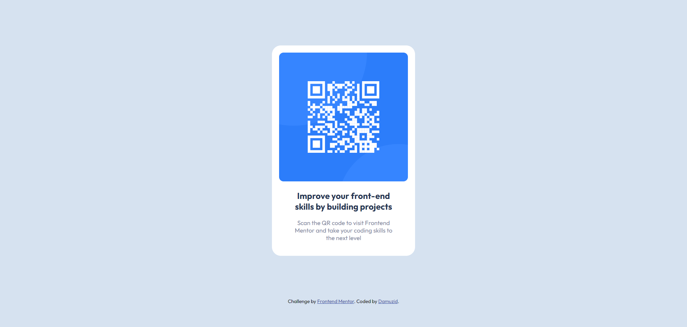

# Frontend Mentor - QR code component solution

This is a solution to the [QR code component challenge on Frontend Mentor](https://www.frontendmentor.io/challenges/qr-code-component-iux_sIO_H). Frontend Mentor challenges help you improve your coding skills by building realistic projects. 

## Table of contents

- [Overview](#overview)
  - [Screenshot](#screenshot)
  - [Links](#links)
  - [Built with](#built-with)
  - [Useful resources](#useful-resources)
- [Author](#author)

## Overview

### Screenshot

### Links

- Frontend Monitor Solution: [https://tinyurl.com/bdzmkp9p](https://tinyurl.com/bdzmkp9p)
- Live Site: [https://damuzid.github.io/qr-code-component/](https://damuzid.github.io/qr-code-component/)

### Built with

- HTML5 markup
- CSS (Flexbox)

### What I learned

I learned to use the relative units of em/rem for padding/margin/widths for better scaling.

### Continued development

Read up some more about the usage of em/rem and how to set an easy to use em to pixel ratio.

### Useful resources

- [MDN Web Docs](https://developer.mozilla.org/en-US/) - I used the Mozilla Web Docs for information.

## Author

- Github - [@Damuzid](https://github.com/Damuzid)
- Frontend Mentor - [@Damuzid](https://www.frontendmentor.io/profile/Damuzid)
